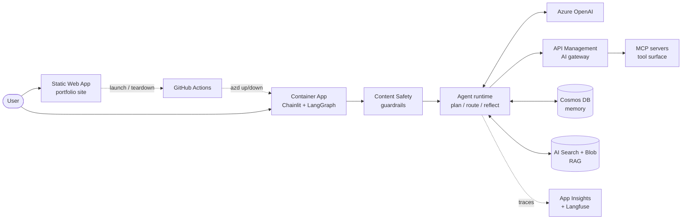
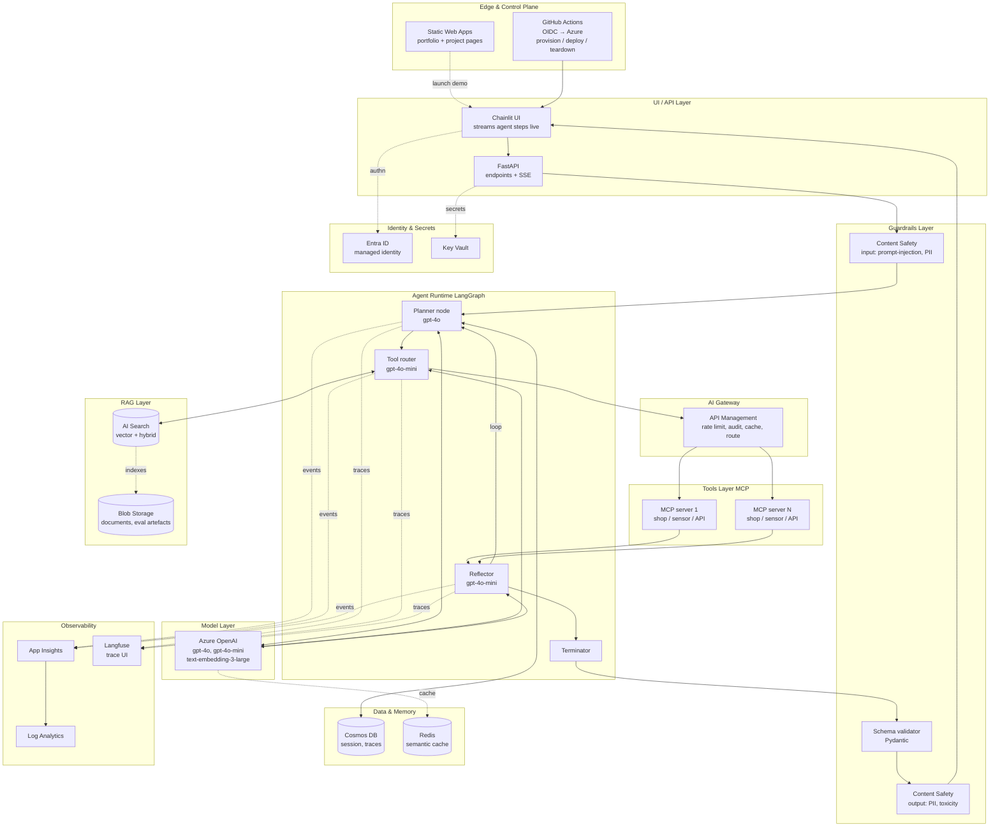

# HelloAgenticAI — Architecture

## Purpose

HelloAgenticAI is the **foundational framework** for agentic AI projects in this portfolio. Project #1 (this one) demonstrates the framework using a universally-understood scenario: an agent shopping a fruit market against a list. Subsequent vertical projects (refinery domain) inherit `framework/` and swap only the demo layer with domain-specific tools, prompts, and evaluations.

The aim of this project is to demonstrate the **machinery** of agentic AI cleanly — every layer visible in code and observable at runtime — not to solve a domain problem.

## High-level architecture

## Detailed architecture (full Azure-native stack)

## Layered breakdown

### 1. Edge & control plane
- **Azure Static Web Apps** hosts the always-on portfolio site. Each project gets a profile page with overview, architecture, tech stack, GitHub link, demo status, and Launch / Teardown buttons.
- **GitHub Actions** is the control plane. Three workflows: `provision-demo` (azd up), `teardown-demo` (azd down), `deploy` (rebuild containers). The portfolio page calls a tiny Azure Function that triggers these via `workflow_dispatch`. Demo costs nothing when not running.

### 2. UI / API layer
- **Chainlit** runs as a Container App. It is the live-flow demo UI: every agent step, tool call, reflection, and replan streams to the user as it happens, with collapsible details. This is the demo magic.
- **FastAPI** under Chainlit exposes a `/run` SSE endpoint and a `/health` endpoint. SSE is used by both Chainlit's UI and the portfolio site if a project wants to embed the live flow.

### 3. Guardrails layer
- **Azure AI Content Safety** screens user input for prompt injection and PII before it reaches the planner.
- **Pydantic schema validators** enforce structured outputs from every agent node.
- **Azure AI Content Safety** screens model output for PII and toxicity before reaching the user.
- All three gates emit events to App Insights when they fire.

### 4. Agent runtime
LangGraph is the orchestration framework. Four canonical nodes that every vertical reuses:
- **Planner** — decomposes goal into sub-goals (gpt-4o)
- **Router** — picks the next tool / sub-agent (gpt-4o-mini)
- **Reflector** — evaluates the latest result, decides loop / replan / finish (gpt-4o-mini)
- **Terminator** — verifies the final state against the goal

The graph is committed under `demo-fruitmarket/graph.py` and rendered in the README.

### 5. AI Gateway
**Azure API Management** sits in front of every external tool call. Rate limiting per tenant, JWT validation, response caching, audit logging, and routing. In v1 it's stubbed (a single APIM instance with one product); refinery verticals plug their real backend APIs in.

### 6. Tools layer (MCP)
Every tool is implemented as an **MCP server**. In v1, mock fruit-shop servers run as Container Apps. In refinery verticals, MCP servers wrap real systems (PI Historian, SAP, DCS, sensor APIs). The agent code is identical across verticals — only the tool implementations change.

### 7. Model layer
- **Azure OpenAI** with deployments for `gpt-4o` (planner), `gpt-4o-mini` (router/reflector/tools), `text-embedding-3-large` (RAG).
- All access via **managed identity** (no keys).
- **Azure Cache for Redis** provides a semantic cache to dedupe repeat queries — material cost saver in agent loops.

### 8. Data & memory layer
- **Cosmos DB** (NoSQL API) holds session state, conversation history, and agent traces. Free tier covers v1.
- Schema designed for verticals to extend without breaking the framework.

### 9. RAG layer
- **Azure AI Search** for vector + hybrid retrieval.
- **Blob Storage** for source documents and the agent's eval artefacts (run transcripts, evaluation results).
- In v1, RAG is stubbed; the fruit market doesn't need it. Refinery verticals will wire it up for technical manuals, P&IDs, MOC documents.

### 10. Identity & secrets
- **Microsoft Entra ID** — every Azure-to-Azure call uses managed identity. Zero secrets in code.
- **Key Vault** holds anything that genuinely must be a secret (Langfuse API key, third-party tokens).

### 11. Observability
- **Application Insights** captures every agent event with correlation IDs across nodes. Used for the production-style angle.
- **Log Analytics** aggregates traces and exposes Kusto queries for analysis.
- **Langfuse Cloud (free tier)** gives a polished trace UI for the live demo. SDK calls only; the two API keys live in Key Vault. See [ADR-0001](decisions/0001-langfuse-cloud-vs-selfhosted.md) for the rationale (vs. self-hosted) and the upgrade path. Self-hosted Langfuse remains the documented option for refinery verticals with compliance constraints that disallow SaaS observability.

### 12. CI/CD
- **GitHub Actions with OIDC** federated credentials → Azure (zero secrets stored in GitHub).
- **Azure Bicep** for IaC, organised into modules per service.
- **Azure Developer CLI** (`azd up` / `azd down`) provisions or tears down the entire stack in one command.

## Publishing strategy

Two-tier:

**Tier 1 — always-on portfolio site** (Static Web Apps, free)
- One page per project with overview, diagrams, tech stack, README highlights, GitHub link, and a live demo status badge.
- Zero ongoing cost.

**Tier 2 — on-demand live demo**
- "Launch demo" button on the project page → calls a tiny Azure Function → triggers the `provision-demo` GitHub Actions workflow → workflow runs `azd up` → posts the live FQDN back to the project page.
- "Teardown" button → triggers `teardown-demo` workflow → `azd down` → resource group is wiped.
- Demo runs only while a reviewer or interviewer needs it. Container Apps scale to zero anyway, but full RG teardown drives cost to zero.

The control plane itself becomes a portfolio signal — IaC + CI/CD automation is part of the project, not separate from it.

## Framework contract for vertical projects

Refinery projects (and any other future vertical) inherit by:

1. Importing `framework/`
2. Implementing the `MCPToolBase` interface for domain systems (PI Historian, SAP, DCS, sensor APIs)
3. Subclassing `AgentBase` with domain-specific planner / reflector prompts
4. Providing eval cases as JSON under their own `eval/cases/`
5. Reusing the Bicep modules in `infra/modules/`, parameterised
6. Connecting to the same App Insights / Langfuse / Cosmos schemas

What changes per vertical: tools, prompts, eval cases, Bicep parameters.
What stays constant: the agent runtime, observability schema, guardrails, eval harness, infra modules, repo layout.

## What's in v1 vs framework hooks

**Built end-to-end in v1:**
Chainlit + LangGraph + Container Apps + Azure OpenAI + Cosmos DB + App Insights + Langfuse Cloud + Content Safety + Bicep + GitHub Actions + eval harness + fruit market demo.

**Framework hooks ready, wired in v2+:**
APIM (AI Gateway), AI Search + Blob (RAG), Azure Functions (long-tail tools), Redis (semantic cache), Private Endpoints, VNet integration.

This is intentional — v1 demonstrates the full architecture cleanly without bloating the demo. Stubbed services have TODO comments in code so reviewers see the architectural intent.

## Architecture Decision Records

Significant decisions are captured as ADRs under [`docs/decisions/`](decisions/), numbered chronologically:

- [ADR-0000](decisions/0000-template.md) — template
- [ADR-0001](decisions/0001-langfuse-cloud-vs-selfhosted.md) — Langfuse Cloud (free tier) for v1, not self-hosted
- [ADR-0002](decisions/0002-portfolio-site-stack-astro.md) — Portfolio site stack: Astro + Tailwind on Azure Static Web Apps
- [ADR-0003](decisions/0003-azd-up-preflight-risks.md) — `azd up` preflight risks for HelloAgenticAI v1
