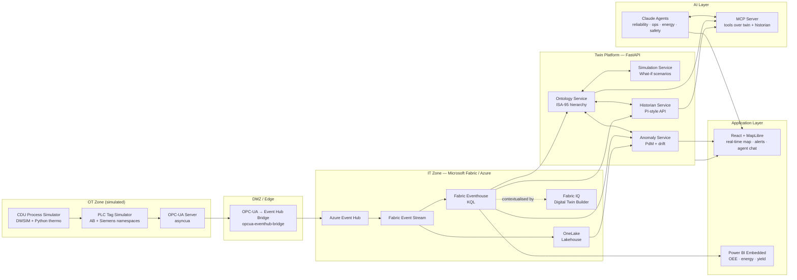

# 01 — Architecture

**Status:** Frozen
**Last review:** [date]

## 1. Architectural principles

These are non-negotiable. Every design choice must satisfy all five.

1. **ISA-95 first.** The asset hierarchy is the spine. Every piece of telemetry, every alert, every agent action resolves to a node in the hierarchy.
2. **Real-time by default, batch where it makes sense.** Hot path goes through Eventhouse; cold path lands in OneLake. No batch-only views of operational data.
3. **OT and IT are separate.** The simulator and OPC-UA server live in a logical OT zone. Crossings are explicit, logged, and unidirectional where possible.
4. **Generic core, domain at the edges.** Refinery-specific logic lives in the simulator, ontology files, and agent prompts. The platform itself is industry-agnostic.
5. **Architecture survives the trial.** Fabric is the primary target; Azure-only is the documented fallback. No design relies on a Fabric-only feature without a documented Azure equivalent.

## 2. Logical architecture

## 3. Component responsibilities

### 3.1 OT Zone (simulated)

**CDU Process Simulator** — produces physically plausible state for a CDU running 24×7. Mass and energy balance, simplified atmospheric column model, pump/heater curves. Configurable feed quality. Six injectable scenarios for what-if and fault simulation.

**PLC Tag Simulator** — wraps simulator state as PLC-style tags using Allen-Bradley (`Program:CDU.HeaterH101.OutletTemp`) and Siemens (`DB10.DBD0`) naming conventions. Generates ~80–100 tags including production counts, machine state, alarms, key process parameters.

**OPC-UA Server** — exposes tags via OPC-UA standard. Implements the full OPC-UA address space, supports subscriptions and historical reads. This is **real OPC-UA**, not a mock.

### 3.2 DMZ / Edge

**OPC-UA → Event Hub Bridge** — single-purpose adapter. Subscribes to OPC-UA tags, converts to JSON events, publishes to Event Hub. Implements Purdue-model OT/IT crossing. Logs every subscription and every message.

### 3.3 IT Zone (Fabric / Azure)

**Azure Event Hub** — partitioned ingest. AMQP and Kafka-compatible. Single source of truth for incoming telemetry.

**Fabric Event Stream** — declarative routing and transformation. Drops malformed events, enriches with ontology IDs, splits into hot (Eventhouse) and cold (OneLake) paths.

**Fabric Eventhouse** — KQL store for hot data. Supports sub-second analytics, materialized views, anomaly detection KQL plugins. Default retention: 30 days hot, archived to OneLake.

**OneLake** — long-term governed storage. Delta tables for telemetry, ontology, alerts, agent transcripts.

**Fabric IQ / DT Builder** — declares the digital twin ontology in Fabric's native format. Ties Eventhouse data to ontology nodes.

### 3.4 Twin Platform (FastAPI services)

**Ontology Service** — owns the ISA-95 hierarchy. Read API for asset trees, sub-asset lookups, parent traversal. Source-of-truth Postgres. Loads from `docs/ontology/*.json` on boot.

**Simulation Service** — wraps DWSIM (or Python thermo fallback) behind a REST API. Run a what-if scenario, get back a time-stamped state delta.

**Anomaly Service** — runs trained PdM models against live tag streams. Surfaces alerts to the dashboard and to MCP. Online drift detection via River.

**Historian Service** — PI-style time-series query API. `GET /tag/{name}?from=...&to=...&interval=...`. Backend is Eventhouse with cold queries falling through to OneLake.

### 3.5 AI Layer

**MCP Server** — custom Model Context Protocol server exposing tools:
- `get_asset_state(asset_id)` — current state of an asset from ontology + historian
- `query_historian(tag, from, to, agg)` — time-series query
- `list_active_alerts(unit_id, severity)` — current alerts
- `run_what_if(scenario_id, params)` — execute simulation
- `get_sop(equipment_class, situation)` — retrieve SOP excerpts (RAG)
- `predict_failure(asset_id, horizon)` — call anomaly service for RUL

**Four agents** (Anthropic Claude with the MCP tools above):
- Reliability — focused prompt, tools = predict_failure + query_historian + get_asset_state
- Operations — tools = list_active_alerts + query_historian + get_sop
- Energy — tools = query_historian + run_what_if (energy scenarios)
- Safety — tools = get_sop + get_asset_state (read-only, no execution)

### 3.6 Application Layer

**React + MapLibre** — single-page app. Layout: left = map of CDU equipment, right = side panel with selected asset, top = active alerts, bottom = agent chat. WebSocket connection for live updates.

**Power BI Embedded** — OEE, energy intensity, yield by product, alarm rates. DirectQuery against Eventhouse.

## 4. Data flow scenarios

### 4.1 Normal-state telemetry path (sub-second)

1. Simulator updates state every 1s
2. PLC simulator publishes new tag values
3. OPC-UA server fires subscription notifications
4. Bridge converts and publishes to Event Hub
5. Event Stream routes to Eventhouse (hot) and OneLake (cold)
6. Web dashboard's WebSocket receives delta from Twin Platform (which polls Eventhouse)
7. End-to-end target: < 2s simulator → screen

### 4.2 Anomaly path

1. Anomaly Service polls Eventhouse every 5s
2. PdM model fires
3. Alert written to Eventhouse alerts table + posted to Twin Platform alert topic
4. Dashboard shows alert; reliability agent has access via MCP
5. Operator clicks "explain" → agent retrieves recent tags + SOPs → answers

### 4.3 What-if path

1. User picks scenario from dashboard
2. Simulation Service runs DWSIM/thermo with adjusted parameters
3. Output state diff posted to Twin Platform
4. Dashboard renders side-by-side comparison
5. Energy agent (optional) summarises trade-offs

## 5. Cross-cutting concerns

### 5.1 Security (IEC 62443-aligned, demonstrator level)

- OT zone is a Docker network; no inbound reachability from IT zone
- Bridge is the only crossing; bridge writes to Event Hub via service principal with namespace-only scope
- All Fabric / Azure access via managed identity; no secrets in repo
- MCP server has tool-level allow-list per agent
- Documented gap analysis vs production IEC 62443 in ADR-0005

### 5.2 Observability

- OpenTelemetry traces from web → twin platform → MCP → agent
- Structured JSON logs with `tenant_id`, `unit_id`, `asset_id` always present
- Eventhouse holds last 30 days of platform logs for self-monitoring

### 5.3 Resilience

- Simulator and platform restart cleanly with no data loss (Event Hub retention covers gaps)
- Eventhouse downtime is non-fatal; dashboard degrades to "stale" indicator
- Agents fail gracefully with "tool unavailable" responses

## 6. Deployment topologies

### 6.1 Local dev (laptop)

- Docker Compose: simulator + bridge + Postgres + Redpanda (Event Hub substitute) + Eventhouse-substitute (Postgres + TimescaleDB) + platform services + web app
- No cloud needed
- Used for development and CI

### 6.2 Demo (Fabric trial)

- Real Fabric workspace, real Event Hub, real Eventhouse
- Bicep deploys Azure infrastructure; Terraform deploys Fabric workspace
- Used for interview demo

### 6.3 Production-shape (documented, not deployed)

- Azure Application Gateway → AKS-hosted platform services
- Multi-region Event Hub geo-DR
- Fabric capacity F128+ for real workloads
- Documented in `docs/04-non-functional-requirements.md`

## 7. Mapping to JD requirements

See README §"How this maps to the JD" for the full table. Every JD requirement traces to a concrete component above.

## 8. Open questions

These are deliberately left for resolution during build, with deadlines:

- **Q1:** Power BI Embedded licensing for demo — confirm by milestone M2
- **Q2:** DWSIM Python API stability — fallback decision by milestone M1
- **Q3:** MCP server transport (stdio vs HTTP) for multi-agent — decide by M3

Tracked in `docs/backlog/stories.md` as `OPEN-QUESTION` tasks.
