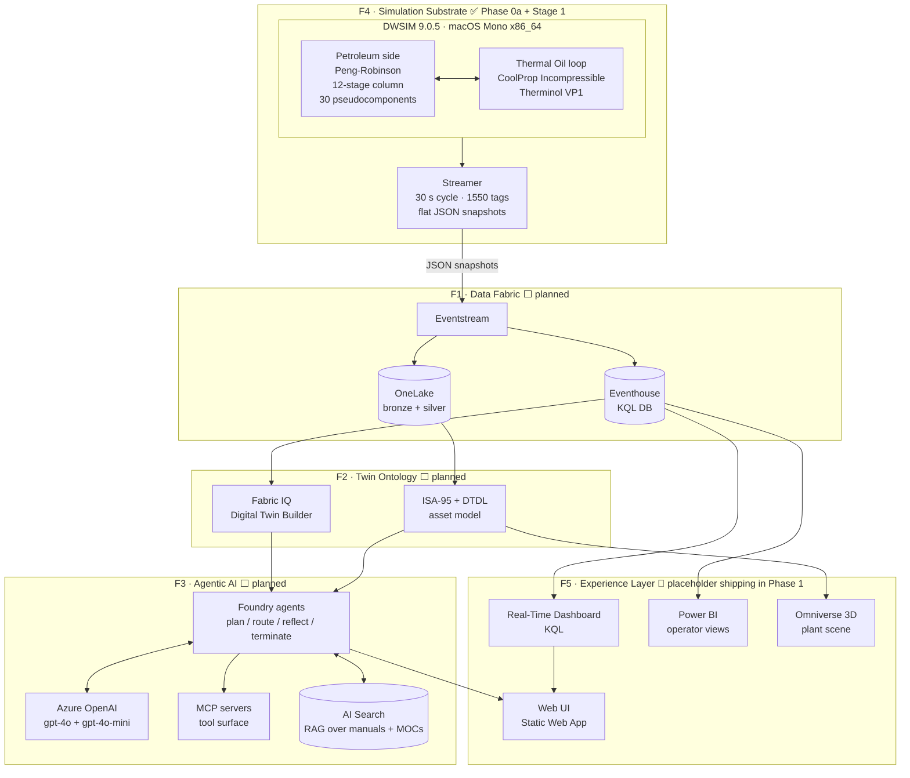

# Refinery Digital Twin — Architecture

## Purpose

Refinery Digital Twin is the petroleum vertical of the AISolutionPortfolio. It demonstrates an Azure-native digital twin grounded in DWSIM steady-state simulation: a locked Petroleum Distillation flowsheet (12-stage column plus thermal oil heating loop) is solved every 30 seconds by a Python streamer, snapshots flow into Microsoft Fabric, an ISA-95-aligned twin ontology indexes them, Foundry agents reason over the live state with MCP-served tools, and a Real-Time Dashboard + Power BI + Omniverse 3D scene render the operator experience. The substrate is small; the layers above are full Azure-native. This is the credentials demo for an industrial AI engineer.

## High-level architecture

## Layered breakdown

### F4 · Simulation substrate ✅ Phase 0a + Stage 1

The locked DWSIM 9.0.5 sample `Petroleum Distillation with Reboiler Heating Fluid.dwxmz` runs on macOS Mono x86_64 via pythonnet. Two coupled subsystems: a 12-stage distillation column (Peng-Robinson, 30 pseudocomponents `PSE_3165_2…31`) and a thermal oil heating loop (CoolProp Incompressible, Therminol VP1). The Stage 1 streamer loads the substrate once, solves every 30 s via `Automation3.CalculateFlowsheet4`, and emits one flat-JSON snapshot per cycle (~1550 tags) to local disk. Phase 0a produced the canonical tag dictionary, setpoint dictionary, and constraint dictionary that drive every layer above.

### F1 · Data fabric ⬜ planned

Eventstream ingests the local snapshot stream and lands rows into an Eventhouse (KQL DB) for sub-second time-series queries. OneLake holds bronze + silver files for batch analytics and downstream training data. Change-data-capture from Eventhouse into the twin layer keeps Fabric IQ synchronised with the live solve.

### F2 · Twin ontology ⬜ planned

Fabric IQ Digital Twin Builder hosts the asset graph. Modeling follows ISA-95 (enterprise → site → area → unit → equipment) with DTDL definitions per equipment class. Live tag values from Eventhouse populate twin properties; the twin exposes an OData-style query surface that the agent layer consumes. Phase 0a's `subsystem` field on every tag (`petroleum` | `thermal_oil`) maps directly to ISA-95 unit groupings.

### F3 · Agentic AI ⬜ planned

Foundry agents implement the canonical plan / route / reflect / terminate loop (inherited from HelloAgenticAI's `framework/` package) against Azure OpenAI (gpt-4o for the planner, gpt-4o-mini for the router and reflector). MCP servers wrap twin queries, KQL queries, and reference-doc retrieval. AI Search provides RAG over technical manuals, P&IDs, and Management of Change records. Guardrails (Content Safety + Pydantic schema validation) sit on input and output gates per the framework's pattern.

### F5 · Experience layer 🔄 placeholder shipping in Phase 1

Phase 1 (this briefing) ships a placeholder Static Web App so the portfolio profile page has a Launch URL. Full F5 arrives later: a Real-Time Dashboard (KQL) for live tag visualisation, Power BI for operator-style analytics, a web UI streaming live agent flows (via Chainlit/SSE inherited from the framework), and an Omniverse 3D scene of the plant — all backed by the same Eventhouse + twin.

## Demo experience

Reviewer clicks Launch on the portfolio profile → the `rg-refinerydigitaltwin-dev` resource group provisions in ~10 minutes via the GitHub Actions `deploy.yml` (OIDC auth, no secrets in GitHub) → the placeholder page comes up. After full F5 lands: live snapshots flowing, agent answering operator-style questions ("why did `Reboiler Duty (2)` drop 5 % in the last cycle?"), 3D view of the column with the agent's reasoning highlighted on the relevant equipment. Teardown drives cost to zero between sessions.

## Framework alignment

This project inherits HelloAgenticAI's `framework/` package — `agents/`, `tools/`, `memory/`, `observability/`, `guardrails/`, `llm/`, `eval/` — and provides the **petroleum vertical** swap-out: DWSIM-aware MCP servers, refinery-domain prompts, eval cases anchored on real flowsheet behaviour. What changes per vertical: tools, prompts, eval cases, Bicep parameters. What stays constant: agent runtime, observability schema, guardrails, eval harness, infra modules, repo layout.

## Architecture Decision Records

ADRs emerging from this project live under `docs/decisions/`, numbered chronologically (mirroring HelloAgenticAI's pattern). Phase 0a's two architect overrides (Storage Tank → `thermal_oil`; Reboiler Duty energy stream → `petroleum`) and Phase 1's Q1–Q3 resolutions (project-local pre-commit, candidate-canonical `deploy.yml`, candidate-canonical `project-metadata.md` schema) are candidates for retroactive ADR capture once HelloAgenticAI Phase 5 lands its corresponding patterns and any re-alignment is decided.

---

*Phase status (last updated: this commit): F4 ✅ Phase 0a + Stage 1 done · F5 🔄 placeholder shipping in Phase 1 foundation · F1, F2, F3 ⬜ planned.*
